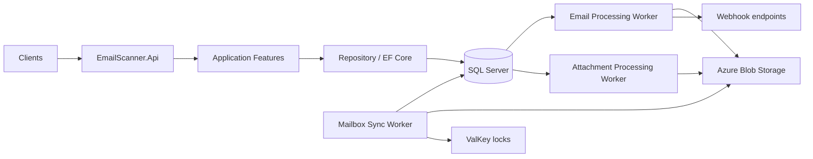

# Dream-IT EmailScanner

EmailScanner is a multi-tenant .NET 8 platform for importing mail, processing message and attachment metadata, and delivering signed webhooks. The solution separates domain rules, application features, persistence, API hosting, and background workers.

## Architecture

## Projects

`Domain.Abstractions` provides entity identity, aggregate, audit, and domain event contracts. `Domain` owns tenant, mailbox, email, rule, webhook, and attachment behavior. `Application.Abstractions` contains feature contracts and result types, while `Application` contains use-case features and validation. `Repository.Abstractions` defines persistence contracts; `Repository` uses EF Core and SQL Server configurations. Blob Storage and ValKey adapters are isolated in their own infrastructure projects. The API and three workers are independent .NET hosts.

## Getting started

Requirements: .NET 8 SDK and Docker Compose.

1. Start local dependencies: `docker compose up -d`.
2. Configure `ConnectionStrings:EmailScanner`, `BlobStorage:ConnectionString`, `ValKey:ConnectionString`, and at least one API client in user secrets or environment variables.
3. Restore/build: `dotnet restore` and `dotnet build`.
4. Apply EF migrations after creating the first migration: `dotnet ef database update --project src/EmailScanner.Repository --startup-project src/EmailScanner.Api`.
5. Run the API: `dotnet run --project src/EmailScanner.Api`.

Local API clients are configured under `ApiClients:{clientId}` with `Secret`, `TenantId`, and comma-delimited `Permissions`. Requests use `X-Client-Id`, `X-Client-Secret`, and optional `X-Correlation-Id` headers. Keep secrets out of committed configuration files.

## Configuration and services

SQL Server connection settings use `ConnectionStrings:EmailScanner`. EF Core is configured for transient retry. Blob objects are private and use the paths `emails/{tenantId}/{mailboxConnectionId}/{emailId}/original.eml` and `attachments/{attachmentId}/{fileName}`. ValKey is compatible with Redis and holds expiring distributed leases; mailbox locks use `mailbox-sync:{mailboxConnectionId}`. `/health` reports SQL Server readiness.

The API accepts API keys through the client ID and secret headers. Webhook entities require HTTPS URLs. Webhook payload signing should use an HMAC SHA-256 signature generated from the raw request bytes and each endpoint's secret; consumers should compare signatures in constant time and reject stale timestamps.

The worker hosts are separate deployable processes so mailbox polling, email parsing, and attachment processing can be scaled independently. Their provider adapters and operational queue configuration should be supplied for each deployment environment.

The mailbox sync worker polls enabled IMAP connections using MailKit. Configure it with `ConnectionStrings__EmailScanner`, `BlobStorage__ConnectionString`, `BlobStorage__ContainerName`, and `ValKey__ConnectionString`; `MailboxSync__PollIntervalSeconds` is optional and defaults to 30. Run it with `dotnet run --project src/EmailScanner.Worker.MailboxSync`. IMAP connections require provider value `2`, host, port, username, and a password in `ImapCredentialReference`. The worker uses IMAP UID validity and UID checkpoints for delta sync, stores the original MIME message in blob storage, and saves message and recipient records to SQL Server.

The email processing worker classifies queued emails and saves extracted documents and entities. Run it with `dotnet run --project src/EmailScanner.Worker.EmailProcessing`; it reads the same SQL Server connection string and ValKey settings. `EmailClassification:PersistThreshold` and `EmailClassification:LlmThreshold` are percentage values, defaulting to 90 and 60. LLM fallback is disabled in the sample config until `AzureOpenAI:Endpoint`, `AzureOpenAI:Deployment`, and `AzureOpenAI:ApiKey` are configured; enable it with `EmailClassification:EnableLlmClassification=true`. The deployment defaults to `gpt-5-mini`. Manage tenant-specific sender rules through `GET`, `GET/{id}`, `POST`, `PUT/{id}`, and `DELETE/{id}` under `/api/v1/watched-senders`; write operations require `rules:write`.

## Tests

Run `dotnet test EmailScanner.sln`. Domain tests cover ownership and value validation, application tests cover feature result semantics, and repository tests validate the EF model without requiring a live SQL Server.
